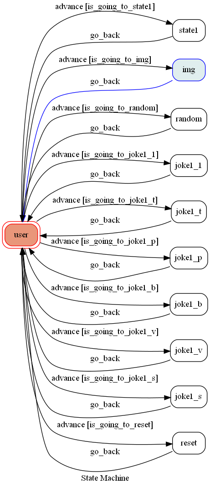

# TOC Project 2020

A Line bot based on a finite state machine

More details in the [Slides](https://hackmd.io/@TTW/ToC-2019-Project#) and [FAQ](https://hackmd.io/s/B1Xw7E8kN)

## How to use?

* 輸入"哈囉"或"hello"啟動機器
* 照指示輸入內容即可生成笑話
* 途中可輸入"退出"重新啟動
* 輸入"fsm"機器人會傳送state-machine的架構圖

## Finite State Machine

## Reference
本次期末專題的構想來源：
[蘇聯笑話生成器](https://namespacexp.github.io/joke/)
